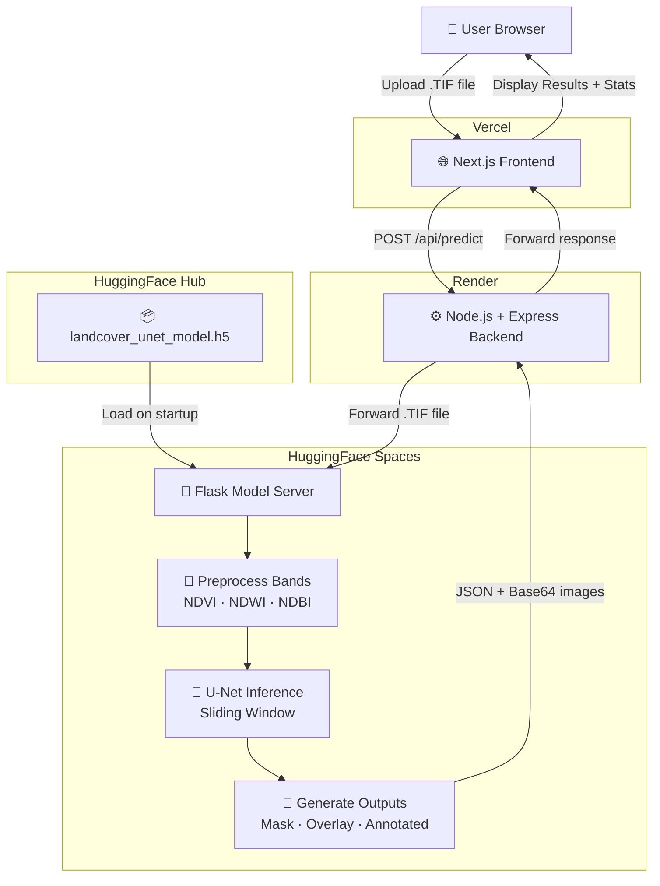

<a name="top"></a>

<div align="center">

&nbsp;&nbsp;&nbsp;&nbsp;
&nbsp;&nbsp;&nbsp;&nbsp;
&nbsp;&nbsp;&nbsp;&nbsp;


<br/><br/>

# 🛰️ LandCover**AI**

### Sentinel-2 Land Use & Land Cover Classification

[](https://landcover-frontend.vercel.app)
[](https://huggingface.co/bhargav37/lulc-dl-model)
[](https://landcover-backend.onrender.com)

*Upload a Sentinel-2 satellite image and get instant AI-powered land cover segmentation.*

</div>

---

## 🌍 What is LandCoverAI?

LandCoverAI is a full-stack geospatial intelligence web application that accepts a **Sentinel-2 multispectral .TIF image** and classifies every pixel into one of 6 land cover categories using a deep learning U-Net model. The results are presented as three rich visual outputs — all downloadable.

---

## 🗺️ Land Cover Classes

| Class | Colour |
|---|---|
| 🟫 Barren Land | Sandy Brown |
| 🔴 Built-up Area | Crimson Red |
| 🟡 Crop | Yellow |
| 🟢 Forest | Green |
| 🔵 Water | Blue |
| ⚫ Unclassified | Black |

---

## 📊 Output Visualisations

| Output | Description |
|---|---|
| **Segmentation Mask** | Colour-coded pixel-wise class map |
| **RGB + Overlay** | Original satellite image blended with the classification |
| **Annotated** | RGB image with class labels and confidence scores |

All three outputs are downloadable as PNG files directly from the UI.

---

## 🧠 Deep Learning Model

The model is a **U-Net** architecture trained on Sentinel-2 imagery. It takes a **16-channel input** — the original 13 Sentinel-2 bands plus three computed spectral indices:

- **NDVI** — Normalised Difference Vegetation Index
- **NDWI** — Normalised Difference Water Index
- **NDBI** — Normalised Difference Built-up Index

A **sliding window inference** strategy is used to handle large images efficiently.

> 📖 Full model details, training data, and evaluation metrics → **[View Model on HuggingFace](https://huggingface.co/bhargav37/lulc-dl-model)**

---

## 🏗️ Architecture


---

## 🛠️ Tech Stack

| Layer | Technology | Hosted On |
|---|---|---|
| **Frontend** | Next.js 14 · TypeScript · CSS | Vercel |
| **Backend** | Node.js · Express.js · Multer | Render |
| **Model Server** | Python · Flask · TensorFlow · Rasterio | HuggingFace Spaces |
| **Model Storage** | HuggingFace Hub (.h5) | HuggingFace |

---

## 📁 Project Structure

```
LULC-DL/
├── frontend/          # Next.js + TypeScript UI
├── backend/           # Node.js + Express API gateway
└── model-server/      # Python + Flask inference server
```

---

## 🔗 Deployment Links

| Service | URL |
|---|---|
| 🌐 Frontend | [landcover-frontend.vercel.app](https://landcover-frontend.vercel.app) |
| ⚙️ Backend | [landcover-backend.onrender.com](https://landcover-backend.onrender.com) |
| 🧠 Model Server | [bhargav37-landcover-model-server.hf.space](https://bhargav37-landcover-model-server.hf.space) |
| 🤗 Model | [huggingface.co/bhargav37/lulc-dl-model](https://huggingface.co/bhargav37/lulc-dl-model) |

---

## 🏛️ Developed Under

This project was developed at **IIT Tirupati** under the **STAR-PNT Labs**, supported by **NM-ICPS** and in association with **Geointell Labs**, as part of research in geospatial intelligence and remote sensing.

---

<div align="center">

Made with ❤️ for geospatial analysis

**Powered by Geointell Labs · STAR-PNT Labs**

<br/>

[⬆ Back to Top](#top)

</div>